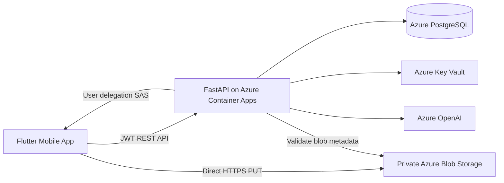

# FitTrack AI

A cloud-native fitness mobile application built with **Flutter**, **FastAPI**, and **Azure**.
Authenticated users track measurements, nutrition, and workouts; review backend-calculated weekly
readiness; receive persisted **Azure OpenAI** recommendations; and upload private progress photos
via direct **Azure Blob Storage** transfers secured with short-lived user-delegation SAS tokens.

**Live API (dev):** `https://ca-fittrack-ai-api-dev.wittydune-377fa2b0.eastus.azurecontainerapps.io`

```bash
curl "https://ca-fittrack-ai-api-dev.wittydune-377fa2b0.eastus.azurecontainerapps.io/health"
# {"status":"ok","service":"fittrack-ai-api","version":"0.1.0"}
```

**Central release document:** [Mobile + Cloud Release Checkpoint](docs/mobile-cloud-release-checkpoint.md)


**CI/CD (Block 6.3):** [Azure OIDC + Protected Backend Deployment](docs/azure-oidc-protected-deployment.md)

---

## Current release status

FitTrack AI has completed the **Mobile + Cloud Release Checkpoint (Block 5.11)**. The Flutter
client, FastAPI backend, and Azure development environment are validated together as a
portfolio-grade, incrementally implemented system — not a production SLA release.

| Item | Value |
|------|-------|
| Backend image | `block-5.8-amd64-fix` |
| Alembic revision | `a8c3b1d92e47` |
| Backend tests | 100 passed |
| Flutter tests | 319 passed (+ 1 cloud E2E opt-in skipped) |
| Terraform plan | No changes (remote state + OIDC — Block 6.3) |
| CI/CD | [OIDC plan + protected deploy](docs/azure-oidc-protected-deployment.md) |
| Cloud health | HTTP 200 |

Prior backend-only checkpoint: [docs/backend-cloud-checkpoint.md](docs/backend-cloud-checkpoint.md)

---

## Architecture



---

## Main features

| Feature | Mobile | Backend | Cloud |
|---------|--------|---------|-------|
| Authentication (JWT) | Yes | Yes | Validated |
| Dashboard | Yes | Yes | Validated |
| Measurements (list/create) | Yes | Yes | Validated |
| Nutrition logs (list/create) | Yes | Yes | Validated |
| Workouts (exercise-level log) | Yes | Yes | Validated |
| Weekly summary + AI recommendations | Yes | Yes | Validated |
| Progress photos (direct Blob upload) | Yes | Yes | Validated |

See the [feature matrix](docs/mobile-cloud-release-checkpoint.md#8-feature-matrix) for CRUD
limitations.

---

## Tech stack

| Layer | Technologies |
|-------|--------------|
| Mobile | Flutter 3.13.7, Dart 3.1.3, Riverpod, go_router, Dio, flutter_secure_storage |
| API | Python 3.11, FastAPI, Pydantic, SQLAlchemy async, Alembic |
| Database | PostgreSQL 16 (Azure Flexible Server) |
| Cloud | Azure Container Apps, ACR, Key Vault, Blob Storage, Azure OpenAI, Log Analytics |
| IaC | Terraform (modular, `azurerm` provider) |

---

## Quick local setup

### Backend

```bash
cd backend
uv sync
docker compose up -d db
uv run alembic upgrade head
uv run uvicorn app.main:app --reload
```

See [backend/README.md](backend/README.md).

### Flutter (cloud API)

```bash
cd mobile
flutter pub get
flutter run \
  --dart-define=APP_ENV=development \
  --dart-define=API_BASE_URL=https://ca-fittrack-ai-api-dev.wittydune-377fa2b0.eastus.azurecontainerapps.io
```

See [mobile/README.md](mobile/README.md) for iOS Simulator and Android Emulator URLs.

---

## CI quality gates (Block 6.1 + 6.2)

Pull requests and pushes to `main` run automated checks via GitHub Actions:

| Check | Workflow | Scope |
|-------|----------|-------|
| **Backend quality** | [Backend CI](.github/workflows/backend-ci.yml) | uv sync, Alembic, Ruff lint, pytest + PostgreSQL |
| **Flutter quality** | [Flutter CI](.github/workflows/flutter-ci.yml) | format, analyze, unit/widget tests |
| **Terraform quality** | [Terraform CI](.github/workflows/terraform-ci.yml) | fmt, validate, Trivy, Gitleaks, file hygiene |

Full documentation:

- [docs/github-actions-quality-gates.md](docs/github-actions-quality-gates.md) — Backend and Flutter (Block 6.1)
- [docs/terraform-ci-security.md](docs/terraform-ci-security.md) — Terraform CI and security (Block 6.2)

No deployment, Azure credentials, or `terraform apply` in these blocks. Cloud-backed Terraform plan is scaffolded but skipped until Block 6.3.

---

## Validation summary

| Check | Result |
|-------|--------|
| Backend `ruff check` | Passed |
| Backend `pytest` | 100/100 |
| Flutter `analyze` | Clean |
| Flutter `test` | 319 passed, 1 skipped |
| Terraform plan | No changes |
| Cloud `/health` | HTTP 200 |

Full evidence: [docs/mobile-cloud-release-checkpoint.md#15-validation-evidence](docs/mobile-cloud-release-checkpoint.md#15-validation-evidence)

---

## Portfolio and demo

- **Checkpoint narrative:** [docs/mobile-cloud-release-checkpoint.md](docs/mobile-cloud-release-checkpoint.md)
- **Demo runbook (5–8 min):** [docs/mobile-cloud-release-checkpoint.md#23-demo-runbook](docs/mobile-cloud-release-checkpoint.md#23-demo-runbook)
- **Interview talking points:** [docs/mobile-cloud-release-checkpoint.md#26-interview-talking-points](docs/mobile-cloud-release-checkpoint.md#26-interview-talking-points)
- **Backend portfolio demo:** [docs/portfolio-demo.md](docs/portfolio-demo.md)
- **Teardown / cost control:** [docs/teardown.md](docs/teardown.md)

---

## Known limitations

- No refresh token (~60 minute JWT expiry)
- No edit/delete for measurements, nutrition, workout logs, or progress photos
- Workout logging is per-exercise, not full session
- Progress photos: gallery only (no camera, thumbnails, delete)
- Azure development environment only; CI quality gates only (no release/deploy pipeline)
- Full list: [docs/mobile-cloud-release-checkpoint.md#21-known-limitations](docs/mobile-cloud-release-checkpoint.md#21-known-limitations)

---

## Documentation index

| Document | Purpose |
|----------|---------|
| [docs/github-actions-quality-gates.md](docs/github-actions-quality-gates.md) | **GitHub Actions CI quality gates (Block 6.1)** |
| [docs/terraform-ci-security.md](docs/terraform-ci-security.md) | **Terraform CI and security checks (Block 6.2)** |
| [docs/mobile-cloud-release-checkpoint.md](docs/mobile-cloud-release-checkpoint.md) | **Mobile + Cloud release checkpoint (Block 5.11)** |
| [docs/backend-cloud-checkpoint.md](docs/backend-cloud-checkpoint.md) | Backend/cloud checkpoint (Block 4.24) |
| [docs/portfolio-demo.md](docs/portfolio-demo.md) | Portfolio overview and interview narrative |
| [docs/mobile-flutter-transition.md](docs/mobile-flutter-transition.md) | Flutter transition journal (Blocks 5.1–5.11) |
| [docs/progress-photos-architecture.md](docs/progress-photos-architecture.md) | Progress photo architecture |
| [docs/azure-blob-progress-photos.md](docs/azure-blob-progress-photos.md) | Azure Blob Storage setup |
| [docs/flutter-progress-photos.md](docs/flutter-progress-photos.md) | Flutter progress photos flow |
| [docs/progress-photos-release-validation.md](docs/progress-photos-release-validation.md) | Cloud release validation (Block 5.10) |
| [docs/flutter-weekly-recommendation.md](docs/flutter-weekly-recommendation.md) | Weekly summary + AI (Block 5.7) |
| [docs/azure-container-apps-deploy.md](docs/azure-container-apps-deploy.md) | ACR + Container Apps deploy |
| [docs/cloud-api-smoke-test.md](docs/cloud-api-smoke-test.md) | Cloud API smoke test runbook |
| [backend/README.md](backend/README.md) | API reference and local dev |
| [mobile/README.md](mobile/README.md) | Flutter setup and architecture |
| [infra/terraform/azure/README.md](infra/terraform/azure/README.md) | Terraform modules and deploy |

Feature-specific Flutter docs: [flutter-auth.md](docs/flutter-auth.md), [flutter-dashboard.md](docs/flutter-dashboard.md), [flutter-measurements.md](docs/flutter-measurements.md), [flutter-nutrition.md](docs/flutter-nutrition.md), [flutter-workouts.md](docs/flutter-workouts.md).

---

## Cost and teardown warning

This demo provisions **real Azure resources** that may incur cost. See [docs/teardown.md](docs/teardown.md).

**Do not run `terraform destroy` unless you intentionally want to remove the demo infrastructure.**

---

## Recommended next phase

**Block 6.3 — Azure OIDC + Protected Backend Deployment** — federated identity, remote Terraform state, cloud-backed plan, protected apply. Terraform static CI is in place (Block 6.2); see [docs/terraform-ci-security.md](docs/terraform-ci-security.md).
