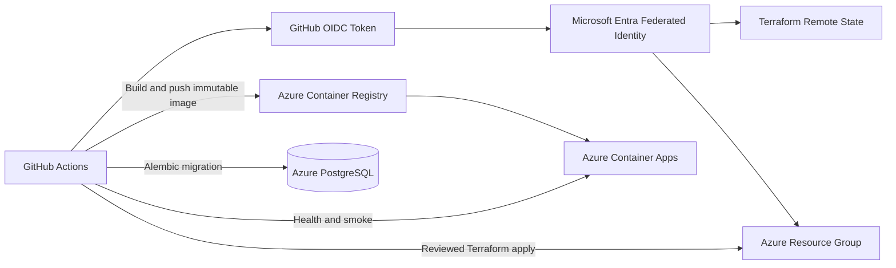

# FitTrack AI — Azure OIDC + Protected Backend Deployment (Block 6.3)

**Block:** 6.3  
**Scope:** Federated GitHub Actions identity, remote Terraform state, cloud-backed plan with safety gate, and manually approved backend deployment to the **development** environment only.

---

## 1. Objective

Replace long-lived Azure client secrets with OIDC and enable:

```text
pull request / main
  → static Terraform quality
  → OIDC-authenticated cloud plan + remote state
  → destroy/replacement safety gate

manual workflow_dispatch (main only, environment: development)
  → immutable ACR image
  → safety-checked Terraform apply (saved plan)
  → Alembic migration
  → Container App readiness + health + optional smokes
```

Block 6.1/6.2 quality workflows are unchanged. Merges to `main` do **not** auto-deploy.

---

## 2. Architecture



### Trust boundaries

| Boundary | Control |
|----------|---------|
| Fork PRs | No Azure credentials; cloud plan skipped |
| Internal PRs | Plan identity only (read + state lock) |
| Deployment | Deploy identity + `environment: development` subject |
| Secrets | Application values in GitHub Secrets; `DATABASE_URL` from Key Vault at runtime |

---

## 3. Identity decision

**Two dedicated User Assigned Managed Identities (UAMIs)** — separate from `id-fittrack-ai-api-dev` runtime identity.

| Identity | Name | Client ID |
|----------|------|-----------|
| Plan | `id-fittrack-github-plan` | `e2799123-394b-4953-a921-376acb3df106` |
| Deploy | `id-fittrack-github-deploy` | `388aa74b-6490-4c25-9b32-b14afc464470` |

No App Registration client secret. No Owner role. No User Access Administrator on routine deploys.

### Federated credential subjects

Issuer: `https://token.actions.githubusercontent.com`  
Audience: `api://AzureADTokenExchange`

| Identity | Subject |
|----------|---------|
| Plan | `repo:fellgar246/project-fittrack-ai:ref:refs/heads/main` |
| Plan | `repo:fellgar246/project-fittrack-ai:pull_request` |
| Deploy | `repo:fellgar246/project-fittrack-ai:environment:development` |

---

## 4. Workflows

| Workflow | File | Trigger |
|----------|------|---------|
| Terraform quality + plan | [`.github/workflows/terraform-ci.yml`](../.github/workflows/terraform-ci.yml) | PR/push (terraform paths), manual |
| Backend deploy | [`.github/workflows/backend-deploy.yml`](../.github/workflows/backend-deploy.yml) | Manual `workflow_dispatch` on `main` only |

Existing [Backend CI](../.github/workflows/backend-ci.yml) and [Flutter CI](../.github/workflows/flutter-ci.yml) are unchanged.

---

## 5. Remote state

| Setting | Value |
|---------|-------|
| Storage account | `stfittrackaidevtf01` |
| Container | `tfstate` |
| State key | `fittrack-ai-dev.tfstate` |
| Auth | Azure AD (`use_azuread_auth = true`); CI sets `ARM_USE_OIDC=true` |

Bootstrap: [`infra/terraform/azure/bootstrap/github-oidc/`](../infra/terraform/azure/bootstrap/github-oidc/README.md)

---

## 6. GitHub configuration checklist

### A. Create environment `development`

1. Repository → Settings → Environments → New environment → `development`
2. Deployment branches: **Selected branches** → `main` only
3. Required reviewers: add at least one reviewer (if plan supports protection rules)
4. Prevent self-review: enable if available

### B. Repository variables

| Variable | Value |
|----------|-------|
| `TERRAFORM_CLOUD_PLAN_ENABLED` | `true` |
| `AZURE_TENANT_ID` | `c3a907a5-9880-40af-b083-9be8604bddc1` |
| `AZURE_SUBSCRIPTION_ID` | `79639552-00e8-43f6-b721-92290a8d36e9` |
| `AZURE_PLAN_CLIENT_ID` | `e2799123-394b-4953-a921-376acb3df106` |
| `TF_BACKEND_RESOURCE_GROUP_NAME` | `rg-fittrack-ai-dev` |
| `TF_BACKEND_STORAGE_ACCOUNT_NAME` | `stfittrackaidevtf01` |
| `TF_BACKEND_CONTAINER_NAME` | `tfstate` |
| `TF_BACKEND_STATE_KEY` | `fittrack-ai-dev.tfstate` |
| `TF_VAR_owner` | `felipe` |
| `TF_VAR_unique_suffix` | `dev01` |
| `TF_VAR_api_ai_provider` | `azure` |
| `TF_VAR_api_image_tag` | `block-5.8-amd64-fix` |
| `TF_VAR_api_azure_openai_api_version` | *(match cloud, e.g. `2024-12-01-preview`)* |
| `AZURE_RESOURCE_GROUP` | `rg-fittrack-ai-dev` |
| `AZURE_ACR_NAME` | `acrfittrackaidevdev01` |
| `AZURE_CONTAINER_APP_NAME` | `ca-fittrack-ai-api-dev` |
| `API_BASE_URL` | `https://ca-fittrack-ai-api-dev.wittydune-377fa2b0.eastus.azurecontainerapps.io` |

### C. Environment `development` variable

| Variable | Value |
|----------|-------|
| `AZURE_DEPLOY_CLIENT_ID` | `388aa74b-6490-4c25-9b32-b14afc464470` |

Also copy repository variables used by deploy (`AZURE_TENANT_ID`, `AZURE_SUBSCRIPTION_ID`, backend vars, `TF_VAR_*`, `API_BASE_URL`, etc.) to the environment if your GitHub plan requires environment-scoped vars for protected jobs.

### D. Repository secrets (OpenAI — required for real cloud plan)

| Secret | Purpose |
|--------|---------|
| `TF_VAR_api_azure_openai_endpoint` | Preserve Azure OpenAI endpoint in plan/apply |
| `TF_VAR_api_azure_openai_api_key` | Preserve Azure OpenAI key in Key Vault |
| `TF_VAR_api_azure_openai_deployment` | Preserve deployment name |

Copy the same secrets to environment `development` if deploy jobs cannot read repository secrets.

**Do not add:** `AZURE_CLIENT_SECRET`, `DATABASE_URL`, storage account keys.

### E. Enable cloud plan

Set `TERRAFORM_CLOUD_PLAN_ENABLED=true`, push to `main`, verify **Terraform plan safety** job passes.

### F. First deployment

1. Actions → **Backend Deploy** → Run workflow (branch `main`)
2. Leave `image_tag` empty (uses `sha-<commit>`)
3. Keep smokes disabled for first run unless needed
4. Approve environment deployment when prompted

---

## 7. Plan safety

Script: [`infra/terraform/scripts/check_plan_safety.py`](../infra/terraform/scripts/check_plan_safety.py)

| Action | Policy |
|--------|--------|
| Creates / updates | Allowed |
| Destroys | **Fail** |
| Replacements | **Fail** |

Plan binaries and JSON are written to `$RUNNER_TEMP` and deleted — never uploaded as artifacts.

---

## 8. Deployment semantics

- **Trigger:** `workflow_dispatch` only (no push deploy)
- **Branch guard:** `github.ref == 'refs/heads/main'`
- **Concurrency:** `fittrack-development-deployment`, `cancel-in-progress: false`
- **Approval:** GitHub Environment `development` gates the apply job before Azure writes
- **Image tag:** default `sha-<short-sha>`; optional rollback tag validated by regex + ACR existence check
- **Apply:** only saved plan file after safety gate
- **Migration order:** deploy image → readiness → Alembic `upgrade head` (expand-compatible; current head `a8c3b1d92e47`)
- **Health:** `GET /health` → HTTP 200 (always)
- **Smokes:** optional via workflow inputs (progress photos / weekly AI)

---

## 9. Rollback

Manual `workflow_dispatch` with `image_tag` set to a previous immutable tag (e.g. `block-5.8-amd64-fix`):

```text
validate tag in ACR → plan → safety gate → apply → readiness → health
```

**Warning:** Application rollback is safe only when the previous image is compatible with the current database schema. No automatic Alembic downgrade.

---

## 10. State lock handling

If a job is cancelled manually during apply, Terraform may leave a state lock.

1. Confirm no other workflow is running
2. Identify lock ID from error message
3. Use `terraform force-unlock <ID>` only after verifying no active apply
4. Never automate `force-unlock`

---

## 11. OIDC failure handling

| Error | Likely cause |
|-------|--------------|
| `AADSTS700213` / no matching federated identity | Wrong subject or client ID |
| Wrong subscription | Missing subscription guard vars |
| `id-token: write` missing | Permissions not set on OIDC job |
| State 403 | Missing Storage Blob Data Contributor on state container |

Never switch to client secret as a workaround.

---

## 12. Threat model

| Risk | Mitigation |
|------|------------|
| Azure secret leaked | OIDC, no client secret |
| Fork obtains Azure token | Plan/deploy skip fork PRs; deploy requires environment subject |
| Broad federated trust | Exact repo/ref/environment subjects |
| Unauthorized deployment | Manual workflow + protected environment |
| Concurrent applies | Deployment concurrency group |
| Hidden destroy | Plan JSON safety gate |
| Plan/apply mismatch | Apply saved plan only |
| Mutable image | Commit-SHA tag + digest |
| Wrong subscription | Explicit subscription validation |
| State corruption | Remote backend locking |
| DB incompatibility on rollback | Documented warning; no auto downgrade |

---

## 13. Known limitations

- Development environment only — no production deployment
- No automatic deploy on merge
- No automatic DB rollback
- No blue-green / canary
- Protected reviewers depend on GitHub plan features
- Azure OpenAI smoke has runtime cost — disabled by default
- GitHub-hosted validation required for final acceptance

---

## 14. Next block

**Block 6.4 — Structured Logging + Request Correlation**

---

## 15. Related docs

- [Terraform CI security](terraform-ci-security.md)
- [GitHub Actions quality gates](github-actions-quality-gates.md)
- [Bootstrap README](../infra/terraform/azure/bootstrap/github-oidc/README.md)
