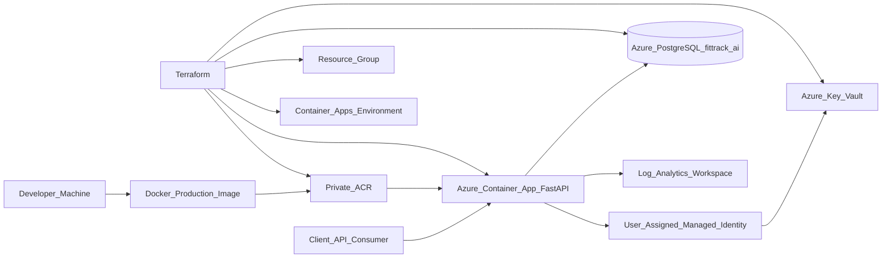
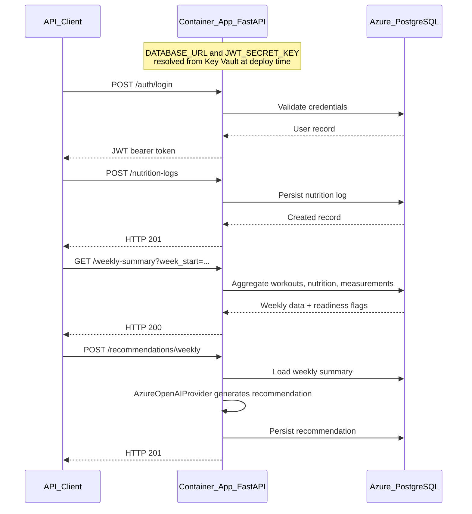

# FitTrack AI — Portfolio Demo

## 1. Executive summary

FitTrack AI is a cloud-native fitness API I built to demonstrate backend engineering, Azure
deployment, infrastructure as code, and applied AI patterns in a reproducible, interview-ready
project.

The system supports authenticated fitness tracking flows — body measurements, nutrition logs,
workout plans, workout logs, weekly summaries, and AI-style weekly recommendations. The backend
is containerized with a production Docker image, published to a private Azure Container Registry,
deployed to Azure Container Apps, and connected to Azure PostgreSQL using secrets from Azure Key
Vault. Infrastructure is managed with modular Terraform and rolled out incrementally across 22+
documented blocks. The cloud API has been validated end-to-end across **19 endpoints** with
real PostgreSQL persistence.

**Live API:** `https://ca-fittrack-ai-api-dev.wittydune-377fa2b0.eastus.azurecontainerapps.io`

---

## 2. What problem this project solves

This is not a consumer fitness product. It is a **technical portfolio piece** that answers:

- Can you build a professional REST API with auth, domain models, and persistence?
- Can you containerize it, deploy to Azure, and manage secrets properly?
- Can you provision cloud infrastructure incrementally with Terraform?
- Can you validate a cloud deployment end-to-end, not just `/health`?
- Can you explain tradeoffs clearly in an interview?

FitTrack AI demonstrates all of the above with documented decisions, limitations, and teardown
guidance.

---

## 3. What was built

### Backend API (FastAPI)

- JWT authentication (`/auth/register`, `/auth/login`, `/auth/me`)
- User-owned fitness data: measurements, nutrition logs, workout plans/logs
- Weekly aggregation (`/weekly-summary`) with data-quality readiness checks
- AI weekly recommendations (`/recommendations/weekly`, `/recommendations/latest`)
- Async SQLAlchemy + Alembic migrations against PostgreSQL
- 66 pytest tests, ruff-clean

### Cloud infrastructure (Azure)

| Resource | Name | Purpose |
|----------|------|---------|
| Resource Group | `rg-fittrack-ai-dev` | Container for all resources |
| Container Registry | `acrfittrackaidevdev01` | Private image storage |
| Container Apps Environment | `cae-fittrack-ai-dev` | Managed runtime environment |
| Container App | `ca-fittrack-ai-api-dev` | FastAPI API (external ingress) |
| Managed Identity | `id-fittrack-ai-api-dev` | AcrPull + Key Vault access |
| Key Vault | `kvfittrackaidevdev01` | `DATABASE_URL`, `JWT_SECRET_KEY`, Azure OpenAI secrets |
| PostgreSQL Flexible Server | `psql-fittrack-ai-pg-dev01` | Database `fittrack_ai` |
| Log Analytics | `log-fittrack-ai-dev` | Container Apps logging |

### Infrastructure as Code (Terraform)

- Modular architecture with `create_*` feature flags
- Incremental rollout: Resource Group → ACR → Container Apps → Key Vault → PostgreSQL
- Firewall rule `allow-aca-egress-01` (ACA egress IP `20.237.42.17`) managed by Terraform
- Manual drift reconciled via `terraform import` (Block 4.20)

### Validation

- Block 4.21 cloud smoke test: 19 endpoints, PostgreSQL persistence confirmed
- Runbook: [cloud-api-smoke-test.md](./cloud-api-smoke-test.md)

---

## 4. Architecture



**How secrets work:** Azure Container Apps resolves Key Vault-backed secret references into the
container environment at deployment/revision time. The FastAPI process reads `DATABASE_URL` and
`JWT_SECRET_KEY` from environment variables — it does **not** call Key Vault on every request.

**How image pull works:** The Container App uses a User Assigned Managed Identity with `AcrPull`
on the private ACR. No registry username/password is stored.

---

## 5. Cloud infrastructure

### Deployment flow

```text
Developer machine
  → docker build (production image)
  → docker tag + push to private ACR
  → Container App pulls image via Managed Identity
  → Container App starts with Key Vault-backed env vars
  → FastAPI connects to Azure PostgreSQL
```

### Terraform module map

| Module | Resource | Flag |
|--------|----------|------|
| `resource_group` | `rg-fittrack-ai-dev` | `create_resource_group` |
| `acr` | Private registry | `create_acr` |
| `container_apps_environment` | Managed environment | `create_container_apps_environment` |
| `container_apps` | API container | `create_container_apps` |
| `managed_identities` | User Assigned Identity | `create_managed_identities` |
| `key_vault` | Secrets store | `create_key_vault` |
| `postgres_flexible` | PostgreSQL server + DB | `create_postgres` |
| `monitoring` | Log Analytics | `create_monitoring` |

Full block journal: [infra/terraform/azure/README.md](../infra/terraform/azure/README.md)

---

## 6. Backend API capabilities

| Domain | Endpoints | Auth | Persists |
|--------|-----------|------|----------|
| Health | `GET /health` | No | No |
| Auth | `POST /auth/register`, `POST /auth/login`, `GET /auth/me` | Bearer for `/me` | User in PostgreSQL |
| Measurements | `POST/GET /measurements`, `GET /measurements/progress` | Bearer | Yes |
| Nutrition | `POST/GET /nutrition-logs`, `GET /nutrition-logs/summary` | Bearer | Yes |
| Workouts | `POST/GET /workout-plans`, `GET /workout-plans/{id}` | Bearer | Yes |
| Workout logs | `POST/GET /workout-logs`, `GET /workout-logs/summary` | Bearer | Yes |
| Weekly | `GET /weekly-summary?week_start=` | Bearer | Aggregates existing data |
| AI | `POST /recommendations/weekly`, `GET /recommendations/latest` | Bearer | Yes |

API reference: [backend/README.md](../backend/README.md)

---

## 7. AI recommendation flow



**Readiness rules** (all required within the week):

- ≥ 1 workout log
- ≥ 3 nutrition logs (distinct dates)
- ≥ 1 body measurement

**Current provider (cloud):** `AzureOpenAIProvider` (`AI_PROVIDER=azure`) — deployment
`fittrack-gpt-5-mini` on resource `test-rg-fittrack-ai-dev`. Validated end-to-end in Block 4.23.

**Fallback:** `FakeAIProvider` (`AI_PROVIDER=fake`) — deterministic Spanish text, no external API
calls. Documented rollback via `terraform.postgres.example.tfvars`. See
[azure-openai-runtime.md](./azure-openai-runtime.md).

---

## 8. Database and migrations

- **Engine:** PostgreSQL 16 on Azure Flexible Server (`psql-fittrack-ai-pg-dev01`)
- **Database:** `fittrack_ai`
- **ORM:** SQLAlchemy async with `psycopg`
- **Migrations:** Alembic (9 tables: users, workout_plans, workout_days, exercises, workout_logs,
  nutrition_logs, body_measurements, ai_recommendations, alembic_version)
- **Cloud migration:** Block 4.18 — `alembic upgrade head` against Azure PostgreSQL via temporary
  firewall rule + Key Vault `DATABASE_URL`
- **Policy:** Migrations are **not** run at container startup (avoids race conditions with replicas)

---

## 9. Security and secrets

| Secret | Storage | Access |
|--------|---------|--------|
| `DATABASE_URL` | Key Vault (`DATABASE-URL`) | Container App secret reference |
| `JWT_SECRET_KEY` | Key Vault (`JWT-SECRET-KEY`) | Container App secret reference |
| `AZURE_OPENAI_*` | Key Vault (`AZURE-OPENAI-*`) | Container App secret references (when `AI_PROVIDER=azure`) |
| ACR pull | Managed Identity (`AcrPull`) | No static credentials |
| Key Vault read | Managed Identity (`Key Vault Secrets User`) | No static credentials |

**What is NOT in the Docker image:** secrets, `.env` files, dev tooling, test suite.

**Demo data policy:** Synthetic emails (`cloud-smoke-*@example.com`), no real personal data.
Tokens and passwords are never documented.

---

## 10. Terraform / IaC approach

### Design principles

1. **Modular** — each Azure resource type in its own Terraform module
2. **Incremental** — `create_*` flags enable/disable modules independently
3. **Safe defaults** — all `create_*` default to `false`; example tfvars opt-in
4. **Documented blocks** — every apply/import documented as Block 4.X in the README journal
5. **Drift reconciliation** — manual resources imported back into state (Block 4.20)

### Scenario files

| File | What it enables |
|------|-----------------|
| `terraform.resource-group.example.tfvars` | Resource Group only |
| `terraform.acr.example.tfvars` | + ACR |
| `terraform.container-apps-environment.example.tfvars` | + Container Apps Environment |
| `terraform.container-apps.example.tfvars` | + Container App |
| `terraform.key-vault.example.tfvars` | + Key Vault + secrets |
| `terraform.postgres.example.tfvars` | Full stack (+ PostgreSQL + firewall) |
| `terraform.azure-openai.example.tfvars` | Full stack + Azure OpenAI wiring |

Quickstart: [infra/terraform/azure/environments/dev/README.md](../infra/terraform/azure/environments/dev/README.md)

---

## 11. Cloud smoke test results

Block 4.21 validated 19 endpoints against the live cloud API with real PostgreSQL persistence.

| Area | Endpoint | Status | What it validates |
|------|----------|--------|-------------------|
| Health | GET /health | 200 | API process alive |
| Auth | POST /auth/register | 201 | User creation in Azure PostgreSQL |
| Auth | POST /auth/login | 200 | Password verification + JWT generation |
| User | GET /auth/me | 200 | Bearer token auth |
| Measurements | POST /measurements | 201 | User-owned measurement persistence |
| Measurements | GET /measurements | 200 | List user measurements |
| Measurements | GET /measurements/progress | 200 | Progress aggregation |
| Nutrition | POST /nutrition-logs (×3) | 201 | Distinct-date log persistence |
| Nutrition | GET /nutrition-logs | 200 | List user logs |
| Nutrition | GET /nutrition-logs/summary | 200 | Nutrition aggregation |
| Workouts | POST /workout-plans | 201 | Plan + nested days/exercises |
| Workouts | GET /workout-plans | 200 | List user plans |
| Workouts | GET /workout-plans/{id} | 200 | Plan detail with exercise IDs |
| Workouts | POST /workout-logs | 201 | Workout log persistence |
| Workouts | GET /workout-logs | 200 | List user logs |
| Workouts | GET /workout-logs/summary | 200 | Workout aggregation |
| Weekly | GET /weekly-summary | 200 | Cross-domain aggregation + AI readiness |
| AI | POST /recommendations/weekly | 201 | Block 4.21 used FakeAIProvider; Block 4.23 validated Azure OpenAI |
| AI | GET /recommendations/latest | 200 | Latest recommendation retrieval |

PostgreSQL counts confirmed: 1 measurement, 3 nutrition logs, 1 plan, 1 workout log, 1
recommendation.

Full runbook: [cloud-api-smoke-test.md](./cloud-api-smoke-test.md)

---

## 12. Key engineering decisions

1. **FastAPI + async SQLAlchemy** — modern Python async API with typed schemas (Pydantic).
2. **PostgreSQL as source of truth** — all user data persisted in a real managed database.
3. **Alembic for versioned schema** — migrations applied explicitly, not at container startup.
4. **Docker production image with non-root runtime** — multi-stage build, `app` user (uid 999).
5. **Azure Container Apps** — serverless container hosting with external ingress and scaling.
6. **Private ACR + Managed Identity + AcrPull** — no static registry credentials.
7. **Azure Key Vault for sensitive config** — `DATABASE_URL` and JWT secret outside the image.
8. **Terraform modular architecture with `create_*` flags** — incremental, cost-controlled rollout.
9. **Incremental cloud rollout by blocks** — each block documented, validated, and reversible.
10. **Azure OpenAI in cloud with FakeAI fallback** — real LLM validated in Block 4.23; deterministic fake provider for local/test.
11. **Public PostgreSQL firewall rule for ACA egress** — dev/portfolio compromise; private networking deferred.
12. **Manual drift reconciled via Terraform import** — Block 4.19 firewall rule brought under IaC in Block 4.20.

---

## 13. Known limitations

- **Flutter mobile app not started** — React Native / Expo was the original plan; Flutter is the next phase.
- **Azure OpenAI latency** — `POST /recommendations/weekly` can take ~20–30s in cloud; no timeout tuning or streaming yet
- **PostgreSQL public endpoint** — narrow firewall rule for ACA egress only; no VNet/private access.
- **No private networking** — VNet integration, Private DNS, NAT Gateway not implemented.
- **No CI/CD pipeline** — deploy is manual (docker build/push + terraform/CLI).
- **No production-grade auth hardening** — JWT basics only; no refresh tokens, MFA, or rate limiting.
- **No custom domain** — uses Azure-generated FQDN.
- **No frontend/admin dashboard** — API-only demo.
- **No observability dashboards** — Log Analytics available but no custom dashboards/alerts.
- **No load testing** — single-user smoke test only.
- **Demo data is synthetic** — test emails, no real personal information.

---

## 14. Cost and teardown notes

### Resources that incur cost

| Resource | Approximate dev cost | Notes |
|----------|---------------------|-------|
| PostgreSQL Flexible Server (`B_Standard_B1ms`) | ~$12–25/month | Largest cost driver |
| Container Apps | Pay-per-use (low for demo traffic) | Scales to zero possible |
| ACR (Basic SKU) | ~$5/month | Image storage |
| Key Vault | Minimal | Per-operation pricing |
| Log Analytics | Minimal | 30-day retention configured |

### Cost control

- All Terraform `create_*` flags default to `false` — example tfvars opt-in only.
- Use scenario files to understand what each flag enables before applying.
- Destroy resources when not needed.

### Teardown (do not run unless intentional)

```bash
cd infra/terraform/azure/environments/dev

# Preview what would be destroyed
terraform plan -destroy -var-file="terraform.postgres.example.tfvars"
```

**Do not run `terraform destroy` unless you intentionally want to remove the demo
infrastructure.** Review the plan carefully before confirming.

### Selective teardown

To remove only PostgreSQL (largest cost):

```bash
# Set create_postgres=false in tfvars, then:
terraform apply -var-file="terraform.postgres.example.tfvars"
```

See [postgres_flexible module teardown](../infra/terraform/azure/modules/postgres_flexible/README.md)
for details. **Do not execute unless intentional rollback.**

---

## 15. How to explain this project in an interview

### 30-second version

> FitTrack AI is a cloud-native fitness API I built to demonstrate backend, Azure, and
> infrastructure skills. It uses FastAPI, PostgreSQL, Docker, and Terraform, deployed to Azure
> Container Apps from a private ACR. Secrets are managed through Key Vault, the schema is
> migrated with Alembic, and I validated the cloud API end-to-end across auth, fitness logs,
> weekly summaries, and AI-style recommendations.

### 90-second version

> I built FitTrack AI as a portfolio project to show I can take a backend API from local
> development to a validated cloud deployment. The API handles authenticated fitness tracking —
> measurements, nutrition, workouts, weekly summaries, and AI recommendations.
>
> I containerized it with a production Docker image, pushed to a private Azure Container Registry,
> and deployed to Azure Container Apps. The app pulls images via Managed Identity and reads
> secrets from Key Vault — no static credentials anywhere.
>
> I provisioned all infrastructure incrementally with modular Terraform, using feature flags to
> control cost and rollout. Each step is documented as a numbered block with validation criteria.
>
> I ran Alembic migrations against the real Azure PostgreSQL, then smoke-tested 19 endpoints
> in cloud — not just health checks, but full CRUD flows with PostgreSQL persistence confirmed.
> For AI recommendations, I validated Azure OpenAI in cloud with deployment `fittrack-gpt-5-mini`
> (Block 4.23). A deterministic FakeAIProvider remains available for local testing and safe
> fallback without external API credentials.
>
> The main tradeoff I made is public PostgreSQL with a narrow firewall rule instead of private
> networking — acceptable for a dev/portfolio demo, with a clear path to harden later.

### Tradeoffs I can discuss

| Topic | Choice made | Alternative | Why |
|-------|-------------|-------------|-----|
| Container hosting | Container Apps | App Service / AKS | Serverless containers, simpler ops for demo |
| PostgreSQL access | Public + firewall rule | Private endpoint + VNet | Dev/portfolio speed; hardening deferred |
| AI provider | Azure OpenAI (cloud) | FakeAIProvider | Real LLM validated; fake for local/test/fallback |
| IaC structure | Modular `create_*` flags | Monolithic stack | Incremental rollout, cost control |
| Secrets | Key Vault references | Plain env vars | Production pattern; no secrets in image |
| Drift handling | `terraform import` | Recreate resource | Preserved working connectivity (Block 4.20) |
| Migrations | Explicit Alembic runs | Auto-migrate at startup | Avoids race conditions with replicas |

---

## 16. Next steps

| Block | Focus | Why |
|-------|-------|-----|
| **4.24 (completed)** | Backend & Cloud Release Checkpoint | Docs, demo checklist, teardown, Flutter transition |
| **5.1 (next)** | Flutter Mobile App Foundation | Mobile client for validated cloud API |
| Private Networking Plan (deferred) | VNet, private PostgreSQL, NAT Gateway | Production hardening |
| Azure Blob Storage (deferred) | Progress photos | Mobile feature extension |

---

## 17. Resume bullets

- Built and deployed a cloud-native FastAPI backend on Azure Container Apps using Docker, private Azure Container Registry, Managed Identity and Terraform.
- Implemented secure runtime configuration with Azure Key Vault and connected the API to Azure PostgreSQL Flexible Server.
- Designed a modular Terraform architecture with incremental apply blocks, feature flags and documented rollback/teardown paths.
- Validated end-to-end cloud flows across auth, fitness tracking, weekly summaries and Azure OpenAI-powered recommendations.
- Implemented an end-to-end cloud validation strategy covering infrastructure, application runtime, database connectivity and AI inference using Azure OpenAI.

---

## 18. Interview talking points

### Why Azure Container Apps instead of AKS?

Azure Container Apps was selected because it is simpler and more cost-effective for a portfolio API, while still supporting managed container hosting, revisions, ingress, scaling and integration with Azure resources.

### Why Key Vault instead of plain env vars?

Key Vault keeps sensitive runtime configuration outside the image and source code. The Container App references secrets securely, and Managed Identity reduces the need for long-lived credentials.

### Why Terraform modules with `create_*` flags?

The project was built incrementally. `create_*` flags allowed safe planning and applying one resource group at a time, reducing risk and making each infrastructure block easier to validate.

### Why public PostgreSQL with narrow firewall rule for the demo?

For portfolio scope, a narrow firewall rule allowed the Container App to reach PostgreSQL without adding private networking complexity too early. For production, this should be replaced with private networking.

### What would change for production?

Production improvements would include private networking, stricter firewall controls, CI/CD release pipelines, monitoring dashboards, alerting, load testing, backups, custom domain, stronger auth and secret rotation.

### How was Azure OpenAI integrated safely?

The backend uses a provider abstraction. FakeAI remains available for deterministic local testing, while Azure OpenAI is enabled in cloud through runtime configuration and Key Vault-managed secrets.

### What issue happened with Azure OpenAI?

The first runtime validation failed because `gpt-5-mini` rejected a non-default temperature parameter. The fix removed the custom `temperature` value, allowing the deployment to use its supported default.

### What is the next phase?

The next phase is building the Flutter mobile client that consumes the validated cloud API.

---

## Related documentation

| Document | Link |
|----------|------|
| Root README | [README.md](../README.md) |
| Backend API reference | [backend/README.md](../backend/README.md) |
| Terraform block journal | [infra/terraform/azure/README.md](../infra/terraform/azure/README.md) |
| Cloud smoke test runbook | [cloud-api-smoke-test.md](./cloud-api-smoke-test.md) |
| Docker production image | [docker-production.md](./docker-production.md) |
| ACR + ACA deploy guide | [azure-container-apps-deploy.md](./azure-container-apps-deploy.md) |
| Azure OpenAI runtime | [azure-openai-runtime.md](./azure-openai-runtime.md) |
| Backend/cloud checkpoint | [backend-cloud-checkpoint.md](./backend-cloud-checkpoint.md) |
| Demo checklist | [backend-cloud-demo-checklist.md](./backend-cloud-demo-checklist.md) |
| Teardown guide | [teardown.md](./teardown.md) |
| Flutter transition | [mobile-flutter-transition.md](./mobile-flutter-transition.md) |
