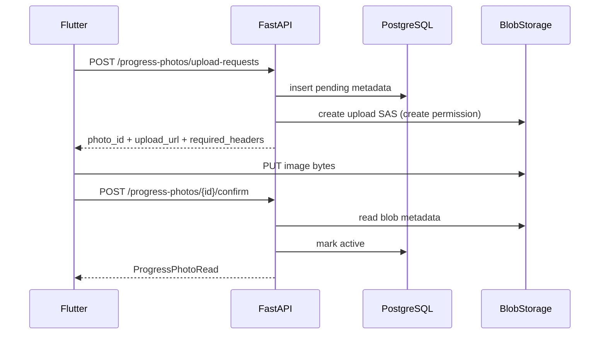
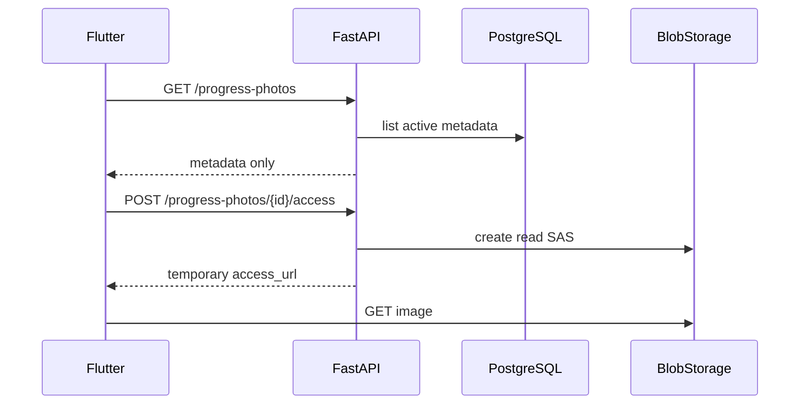

# Progress Photos Architecture (Blocks 5.8–5.10)

Backend, PostgreSQL, Azure Blob Storage, Terraform, Flutter client, and cloud validation for FitTrack AI progress photos. Blocks 5.8 (backend), 5.9 (Flutter), and 5.10 (cloud release validation) are complete.

## Decision: direct upload vs backend proxy

| Criteria | Backend proxy (`Flutter → FastAPI → Blob`) | Direct upload (`Flutter → SAS → Blob → confirm`) |
| --- | --- | --- |
| Mobile complexity | Lower | Higher (3-step flow) |
| Container Apps bandwidth/CPU | High | Low |
| Large file scalability | Poor (timeouts, memory) | Good |
| Byte validation before storage | Easier | Requires confirm step |
| Managed Identity fit | Optional | Strong |
| Testing without Azure | Simple multipart mocks | Fake provider + confirm |

**Decision:** direct-to-Blob upload with short-lived user-delegation SAS.

Tradeoffs accepted:

- Flutter must implement upload request, PUT to Blob, and confirm (Block 5.9).
- Orphan blobs may exist when upload succeeds but confirm never runs; cleanup is documented but not automated here.
- Confirm validates declared blob properties, not deep image decoding.

## Upload sequence



## Read sequence



## Domain model

Table: `progress_photos`

| Field | Notes |
| --- | --- |
| `id` | UUID primary key |
| `user_id` | FK → `users.id` |
| `blob_name` | backend-generated, unique |
| `captured_at` | user-selected capture date |
| `content_type` | allowlisted MIME |
| `size_bytes` | declared size, verified on confirm |
| `notes` | optional |
| `status` | `pending`, `active`, `invalid` |
| `upload_expires_at` | upload SAS expiry |
| `created_at`, `updated_at`, `confirmed_at` | audit timestamps |

Never persisted: SAS tokens, upload/read URLs, account keys, connection strings, client filenames.

## Blob naming

```text
users/{user_id}/progress-photos/{photo_id}/{random_uuid}.{jpg|png|webp}
```

## Allowed content

| MIME | Extension |
| --- | --- |
| `image/jpeg` | `.jpg` |
| `image/png` | `.png` |
| `image/webp` | `.webp` |

Maximum size: `5 * 1024 * 1024` bytes (5 MiB), configurable via `PROGRESS_PHOTO_MAX_BYTES`.

## API contract

### Create upload authorization

```http
POST /progress-photos/upload-requests
Authorization: Bearer <JWT>
```

### Confirm upload

```http
POST /progress-photos/{photo_id}/confirm
Authorization: Bearer <JWT>
```

Idempotent when the photo is already `active`.

### List metadata

```http
GET /progress-photos
Authorization: Bearer <JWT>
```

Returns active photos only, ordered by `captured_at DESC, created_at DESC`. No SAS URLs in list responses.

### Request read access

```http
POST /progress-photos/{photo_id}/access
Authorization: Bearer <JWT>
```

## HTTP error mapping

| Status | Meaning |
| --- | --- |
| 401 | Missing/invalid JWT |
| 404 | Photo not found or not owned by caller |
| 409 | Expired upload, missing blob, mismatch, invalid state |
| 413 | `size_bytes` above limit |
| 415 | Unsupported MIME |
| 422 | Invalid payload |
| 502 | Storage operation failed |
| 503 | Storage unavailable/not configured |

## States and cleanup

| Scenario | Behavior |
| --- | --- |
| Authorization created, never uploaded | Stays `pending`; expires via `upload_expires_at` |
| Blob uploaded, never confirmed | Orphan blob; not listed; future cleanup job |
| Repeat confirm on `active` | Idempotent success |
| MIME/size mismatch on confirm | Marked `invalid`; blob deleted |

## Threat model (minimum)

| Risk | Mitigation |
| --- | --- |
| Cross-user access | PostgreSQL ownership checks, uniform `404` |
| Public container | `publicAccess = None` |
| Reusable SAS | Short TTL, single blob, minimal permissions |
| SAS in logs | Never log full query strings |
| Arbitrary files | MIME allowlist + extension mapping |
| Oversized uploads | Pre-check + confirm against blob size |
| Fake metadata | Confirm reads real blob properties |
| Predictable paths | UUID photo id + random blob suffix |
| Account key exposure | Managed Identity + RBAC, shared key disabled |

## Block 5.9 handoff — implemented

Flutter (Block 5.9) implements:

1. Gallery image picker and preview
2. `POST /progress-photos/upload-requests`
3. Direct PUT to signed URL with required headers (separate Dio client, no bearer)
4. `POST /progress-photos/{id}/confirm` with retry-confirm recovery
5. Gallery using `GET /progress-photos` + `POST /progress-photos/{id}/access`

See [docs/flutter-progress-photos.md](flutter-progress-photos.md).

## Block 5.7 interactive smoke

Completed in Block 5.10 — see [progress-photos-release-validation.md](progress-photos-release-validation.md).
